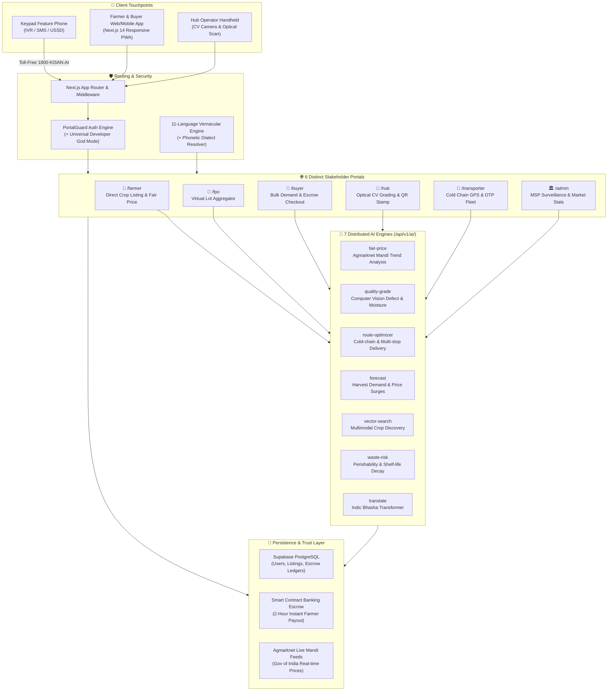

# 🏛️ KisanBandhan AI — Architecture & System Design Document

**Smart India Hackathon 2026 — Problem Statement 26033**  
*Direct Farm-to-Buyer Disintermediation & Vernacular Agri-Tech Infrastructure*

---

## 1. High-Level System Architecture



---

## 2. Directory Structure & Organization

```
sih2026/
├── DEVELOPER_GUIDE.md          # ⚡ 60-second quickstart, Dev login & fast tasks
├── ARCHITECTURE.md             # 🏛️ Architectural blueprint & system diagrams
├── package.json                # Dependencies & build scripts
├── tailwind.config.js          # Tailwind CSS styling tokens
│
└── src/
    ├── app/                    # Next.js 14 App Router Directory
    │   ├── layout.tsx          # Root HTML layout with providers
    │   ├── page.tsx            # Public Marketplace & Ticker (Home)
    │   ├── globals.css         # Custom animations & glassmorphic utilities
    │   │
    │   ├── farmer/page.tsx     # 🚜 FARMER: Voice/text listing, AI pricing, 0% cut
    │   ├── buyer/page.tsx      # 🛒 BUYER: Search, grade filter, bulk escrow orders
    │   ├── fpo/page.tsx        # 🏢 FPO: 50kg -> 500kg lot pooling & corporate bids
    │   ├── hub/page.tsx        # 🔬 HUB: Computer vision optical quality grading
    │   ├── transporter/page.tsx# 🚚 FLEET: GPS live route & delivery OTP verification
    │   ├── admin/page.tsx      # 🏛️ GOV: MSP alerts, price gouging surveillance
    │   │
    │   └── api/v1/             # Backend API Microservices
    │       ├── ai/             # 7 Dedicated AI Microservices
    │       │   ├── fair-price/      # Agmarknet live price calculation
    │       │   ├── quality-grade/   # Computer vision defect & moisture grading
    │       │   ├── route-optimizer/ # Cold-chain transport route planning
    │       │   ├── forecast/        # Demand & harvest price forecasts
    │       │   ├── vector-search/   # Multimodal crop search
    │       │   ├── waste-risk/      # Shelf life & perishability warning
    │       │   └── translate/       # 11 Indian languages translation
    │       ├── crops/          # CRUD for crop listings & catalog
    │       ├── ivr/            # 1800-KISAN-AI feature-phone keypad endpoints
    │       ├── products/       # Public produce search & filter API
    │       ├── sync/           # Offline / Online database sync
    │       └── users/          # Authentication & profile sync
    │
    ├── components/             # Reusable UI Blocks
    │   ├── Navbar.tsx          # Dark glass header with ticker & Dev Role Switcher
    │   ├── PortalGuard.tsx     # Role-based access shield (+ Developer God Mode)
    │   ├── AuthModal.tsx       # 1-Click Dev login, demo accounts & Google OAuth
    │   ├── CartDrawer.tsx      # Escrow-based checkout drawer
    │   ├── CropPhotoSelector.tsx # 352+ crop interactive image selector
    │   └── MultiLangTranslatorModal.tsx # Vernacular dialog
    │
    ├── context/                # Global React Contexts
    │   ├── AuthContext.tsx     # Supabase Auth, session restore & Dev login
    │   ├── RoleContext.tsx     # Multi-role simulation & active portal role
    │   ├── LanguageContext.tsx # 11 Indian language dictionaries
    │   └── CartContext.tsx     # Escrow cart item management
    │
    └── lib/                    # Utilities & Core Domain Models
        ├── cropCatalog.ts      # 352+ certified crops catalog
        ├── fuzzyMatcher.ts     # Phonetic typo & dialect resolver
        ├── i18n.ts             # Complete multi-language strings
        └── supabase.ts         # Supabase client singleton
```

---

## 3. Role & Permission Matrix

| Role | Permitted Routes | PortalGuard Behavior | Key Capability |
|---|---|---|---|
| **⚡ DEVELOPER / ADMIN** | **ALL ROUTES (Universal)** | **Full Automatic Bypass** | Can test/simulate any role without logging out |
| 🚜 **FARMER** | `/farmer`, `/`, API `/crops` | Protected | Direct crop listing, IVR, Fair Price AI |
| 🏢 **FPO** | `/fpo`, `/`, API `/crops` | Protected | Virtual lot pooling, corporate buyer contracts |
| 🛒 **BUYER** | `/buyer`, `/`, API `/orders` | Protected | Quality filtering, cart, smart escrow lock |
| 🔬 **HUB_OPERATOR** | `/hub`, `/`, API `/ai` | Protected | Optical grading, CV trust scores, QR printing |
| 🚚 **TRANSPORTER** | `/transporter`, `/` | Protected | Cold-chain GPS dispatch, delivery OTP payout |

---

## 4. End-to-End Transaction & Escrow Pipeline

1. **Listing:** Farmer registers harvest via Web, Mobile, or toll-free `1800-KISAN-AI`.
2. **Quality Verification:** Hub Quality Inspector performs optical scan; AI assigns Grade A+ / A / B.
3. **Escrow Lock:** Buyer places bulk order; payment is securely locked in Escrow.
4. **Transport:** Transporter picks up certified lot with GPS live tracking.
5. **OTP Handover:** Buyer confirms delivery with 4-digit OTP.
6. **Instant Payout:** Escrow releases 100% of payment directly to Farmer's bank account within 2 hours.
