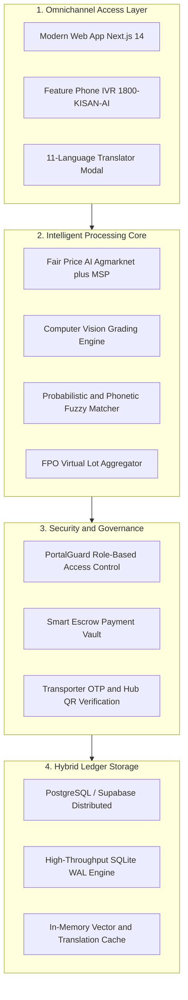

# 🌾 KisanBandhan AI (किसानबंधन)

## Direct Farm-to-Fork Intelligence & Fair-Trade Infrastructure

**Built with Pride for Smart India Hackathon 2026 — Problem Statement 26033**  
*Ministry of Consumer Affairs, Food & Public Distribution | Government of India*

[](https://sih2026-smoky.vercel.app)
[](https://nextjs.org/)
[](https://www.typescriptlang.org/)
[](#core-pillars-what-makes-kisanbandhan-smart)
[](LICENSE)

[🌐 Explore Live Production App](https://sih2026-smoky.vercel.app) • [📖 Architecture](#system-architecture) • [🚀 Quickstart](#getting-started)

---

## The Human Story: Why KisanBandhan Exists

In a nation where over **140 million families depend on agriculture**, our अन्नदाता (food providers) often wake up at 3:00 AM, load their harvest onto shared vehicles, and travel dozens of kilometers to local mandis — only to face:

- **Predatory Middlemen Commissions (up to 30-45%):** Farmers take the production risks, yet brokers capture the bulk of the margin.
- **Subjective Quality Deductions:** Produce is downgraded arbitrarily by visual guesswork, leaving farmers with pennies on the rupee.
- **The Smartphone Barrier:** Over **60% of marginalized smallholders** still use basic feature phones without reliable 4G data.
- **Language & Dialect Gaps:** A farmer writing *"baigan"*, *"began"*, or speaking in their regional dialect is excluded by rigid English-only software.

> **Our Mission:**  
> **KisanBandhan AI** connects the soil of Bharat directly with institutional bulk buyers, food processors, and consumers. We replace middlemen with mathematical fairness, computer vision quality verification, and multimodal vernacular accessibility.

---

## Core Pillars: What Makes KisanBandhan Smart

### 1. Farmer Desk & Fair Price AI Engine

- **Fair Price AI:** Computes live fair market value using real-time Agmarknet mandi trends, dynamic harvest supply, and transportation costs — ensuring farmers never sell below production costs.
- **Smart 7,000+ Crop Catalog:** Instant auto-suggestions across 352 unique produce varieties with interactive photo selector dropdowns.
- **Flexible Photo Verification:** Optional crop photo upload with real-time thumbnail preview directly from the farm.

### 2. Computer Vision Quality Grading

- Objective optical inspection replaces arbitrary hand-picking deductions.
- Inspects size uniformity, surface defect percentages, and color vibrancy to assign verifiable **Grade A+, A, B, or C** ratings certified under FSSAI standards.

### 3. Virtual Lot Aggregation for FPOs

- Empowers smallholder farmers holding 50kg–200kg yields to virtually aggregate into **500kg+ commercial lots**.
- Unlocks wholesale corporate buying contracts without needing expensive physical warehousing.

### 4. 11 Indian Languages & Probabilistic Fuzzy Matcher

- Supports **11 Indian languages** (Hindi, English, Punjabi, Marathi, Gujarati, Bengali, Telugu, Tamil, Kannada, Malayalam, Odia).
- **Phonetic Dialect & Typo Matcher:** Understands regional accents and spelling mistakes:
  - `"baigan"`, `"began"`, `"bagan"`, `"baingan"` are automatically recognized as **बैंगन (Eggplant / Brinjal)** with 98% confidence.
  - `"tmatar"`, `"tamater"` are auto-resolved to **टमाटर (Fresh Tomatoes)**.
  - Zero cognitive barrier for rural users.

### 5. 1800-KISAN-AI: Feature-Phone Keypad IVR

- No smartphone? No problem.
- Farmers can simply dial **1800-KISAN-AI** from any basic keypad phone, press `1` for Tomato, `2` for Onion, speak their quantity, and receive an instant SMS contract confirmation.

### 6. Strict Role Isolation & Escrow Security

- Dedicated portal guards (`PortalGuard.tsx`) isolate 6 distinct stakeholder workflows.
- Buyers cannot checkout without authenticating; payment is locked in transparent smart escrow and only released upon transporter OTP & Hub QR handover verification.

---

## The 6 Stakeholder Portals

| Portal | Route | Primary Role & Capabilities |
| :--- | :--- | :--- |
| **Farmer Desk** | [`/farmer`](https://sih2026-smoky.vercel.app/farmer) | List harvest, Fair Price AI guidance, multi-image upload, crop ledger. |
| **Direct Buyer** | [`/buyer`](https://sih2026-smoky.vercel.app/buyer) | Browse verified lots, place recurring bulk procurement contracts, track orders. |
| **FPO Cooperative** | [`/fpo`](https://sih2026-smoky.vercel.app/fpo) | Aggregate member harvests into high-margin bulk batches, lock lots. |
| **Quality Hub** | [`/hub`](https://sih2026-smoky.vercel.app/hub) | Computer Vision AI grading, moisture & blemish scan, Hub QR tagging. |
| **Transporter Fleet** | [`/transporter`](https://sih2026-smoky.vercel.app/transporter) | Route optimization, multi-hub pickups, OTP handover & delivery verification. |
| **Mandi Governance** | [`/admin`](https://sih2026-smoky.vercel.app/admin) | National MSP enforcement, real-time APMC price ticker, grievance redressal. |

---

## System Architecture



---

## Technology Stack

- **Framework:** Next.js 14 (App Router, Server Components & Dynamic Edge APIs)
- **Language:** TypeScript (Strict Null Checks, 100% Type-Safe)
- **Styling:** Tailwind CSS + Custom Bulma Responsive Agricultural Media Cards
- **Database:** Supabase PostgreSQL + SQLite WAL Hybrid Engine
- **Vernacular Translation:** Custom Multi-Modal Translation Pipeline + Google GTX Neural Translator + MyMemory Memory Fallback
- **Audio & IVR:** Web Speech API + Interactive Telephony Dialpad Emulator
- **Icons & Visuals:** Lucide React, Curated Unsplash Agriculture CDN, Canvas Confetti
- **Deployment:** Vercel Global Edge Network with CI/CD Auto-Sync Workflows

---

## Getting Started

Follow these steps to run the complete KisanBandhan AI platform locally on your machine:

### 1. Clone the Repository

```bash
git clone https://github.com/ctrlaltsolveorg-cloud/sih2026.git
cd sih2026
```

### 2. Install Dependencies

```bash
npm install
```

### 3. Setup Environment Variables

Create a `.env.local` file in the root directory:

```env
NEXT_PUBLIC_SUPABASE_URL=your_supabase_url
NEXT_PUBLIC_SUPABASE_ANON_KEY=your_supabase_anon_key
NEXT_PUBLIC_APP_NAME="KisanBandhan AI"
NEXT_PUBLIC_APP_VERSION="1.0.0"
```

### 4. Run Development Server

```bash
npm run dev
```

Open your browser and navigate to **[http://localhost:3000](http://localhost:3000)**.

### 5. Build for Production

```bash
npm run build
npm start
```

---

## 🤝 Contributing & Team

We welcome contributions from agricultural scientists, developers, and designers passionate about uplifting rural Bharat.

- **Lead Developer & Architect:** Piyush Kumar & Team CtrlAltSolve
- **Collaborators:** Khushboo Kumari & Abhishek Kumar Singh
- **Hackathon:** Smart India Hackathon 2026 (Problem Statement 26033)

---

> **“जय जवान, जय किसान, जय विज्ञान, जय अनुसंधान”**  
> *Empowering the hands that feed our nation.*
